# ml-bdd-pipeline

A modular pipeline for BDD100K dataset analysis and model experimentation, packaged using Docker for reproducibility and easier deployment.

---

# Overview

This project focuses on building a reusable and structured pipeline for the BDD100K object detection dataset.

Instead of directly performing analysis from raw JSON files, the initial focus was to create a clean parsing and loading layer which can later be reused for:

* data analysis
* training
* evaluation
* visualization

Currently the implementation focuses only on the object detection task from BDD100K.
Annotations related to lane markings and drivable areas are filtered out during parsing since they are outside current assignment scope.

---

# Project Structure

```text
ml-bdd-pipeline/
├── src/
│   ├── data/
│   │   ├── categories.py
│   │   ├── entities.py
│   │   ├── filters.py
│   │   ├── parser.py
│   │   ├── loader.py
│   │   └── utils.py
│   │
│   ├── analysis/
│   │   ├── environmental_analysis.py
│   │   ├── environmental_visualization.py
│   │   ├── object_analysis.py
│   │   └── object_visualization.py
│   │
│   ├── train/
│   │   ├── curriculum/
│   │   │   ├── difficulty_analyzer.py
│   │   │   ├── curriculum_scheduler.py
│   │   │   └── curriculum_loader.py
│   │   │
│   │   ├── pipeline/
│   │   │   └── trainer.py
│   │   │
│   │   ├── strategies/
│   │   │   ├── base_strategy.py
│   │   │   └── yolo_strategy.py
│   │   │
│   │   └── utils/
│   │       └── dataset_converter.py
│   │
│   ├── evaluation/
│   │   ├── benchmark/
│   │   │   ├── curriculum_benchmark.py
│   │   │   └── scene_benchmark.py
│   │   │
│   │   ├── metrics/
│   │   │   └── quantitative_evaluator.py
│   │   │
│   │   └── visualizer/
│   │       ├── gt_vs_prediction_visualizer.py
│   │       ├── metrics_visualizer.py
│   │       └── prediction_visualizer.py
│   │
│   ├── tests/
│   │   ├── test_data_pipeline.py
│   │   │
│   │   ├── test_environmental_analysis.py
│   │   ├── test_environmental_visualization.py
│   │   ├── test_object_analysis.py
│   │   ├── test_object_visualization.py
│   │   │
│   │   ├── test_difficulty_analyzer.py
│   │   ├── test_curriculum_loader.py
│   │   ├── test_training_pipeline.py
│   │   ├── test_yolo_converter.py
│   │   │
│   │   ├── test_scene_benchmark.py
│   │   ├── test_scene_based_gt_vs_prediction_visualizer.py
│   │   ├── test_curriculum_based_gt_vs_prediction_visualizer.py
│   │   ├── test_quantitative_curriculum_evaluator.py
│   │   └── test_metrics_visualizer.py
│   │
│   └── main.py
│
├── configs/
├── data/
├── outputs/
├── Dockerfile
├── requirements.txt
├── .dockerignore
├── .gitignore
└── README.md
```

---

# Data Pipeline Flow

```text
BDD JSON Labels + Images
            ↓
        Parser Layer
            ↓
    Annotation Filtering
            ↓
   Structured Entity Objects
            ↓
        Dataset Loader
            ↓
 Visualization / Analysis / Training
```

---

# File Responsibilities

## `src/data/categories.py`

Contains centralized definition of supported BDD100K object detection categories.

Example:

* car
* person
* traffic light
* rider

This was seperated intentionally so category handling remains consistent across the complete pipeline.

---

## `src/data/entities.py`

Defines structured data entities used internally in pipeline.

Main entities:

* `BoundingBox`
* `Annotation`
* `ImageRecord`

Instead of working with deeply nested raw dictionaries everywhere, the parser converts annotations into strongly structured objects.

---

## `src/data/filters.py`

Contains filtering utilities for annotation validation.

Currently used for:

* retaining only supported detection classes
* rejecting lane/drivable-area annotations
* validating presence of `box2d`

---

## `src/data/parser.py`

Responsible for parsing raw BDD100K JSON annotations.

Main responsibilities:

* loading raw JSON
* parsing image metadata
* parsing annotation objects
* converting raw labels into structured entities

The parser also handles filtering internally before constructing final records.

---

## `src/data/loader.py`

Dataset loading layer built on top of parser.

Responsibilities:

* loading image records
* lazy image loading using OpenCV
* providing dataset-like interface using:

  * `__len__`
  * `__getitem__`

This layer is intended to be reused later for:

* Data Ananlysis
* model training Pipeline 
* evaluation

---

## `src/data/utils.py`

Contains utility functions used across the pipeline.

Currently includes:

* annotation visualization utilities
* bounding box rendering helpers

---

## `src/tests/test_data_pipeline.py`

Sanity validation script for the complete data pipeline.

This script validates:

* JSON parsing
* filtering logic
* image loading
* annotation visualization
* bounding box alignment

The script also saves a sample annotated image into `outputs/`.

---

# Prerequisites

* Docker installed
* Git installed

---

# Setup

## Clone Repository

```bash
git clone https://github.com/22VINAYAK98/ml-bdd-pipeline.git
cd ml-bdd-pipeline
```

---

# Dataset Placement

Place downloaded BDD100K dataset under:

```text
data/raw/
```

Example:

```text
data/raw/
├── assignment_data_bdd/
```

---

# Build Docker Image

```bash
docker build -t ml-bdd-pipeline .
```

---

# Run Data Pipeline Validation

```bash
docker run --rm \
-v $(pwd)/data:/app/data \
-v $(pwd)/outputs:/app/outputs \
ml-bdd-pipeline \
python -m src.tests.test_data_pipeline
```

---

# Outputs

Generated outputs such as:

* annotated sample images
* plots
* evaluation artifacts

will be saved under:

```text
outputs/
```

---

# Notes on Data Handling

* `data/` directory is excluded using `.gitignore`
* dataset is mounted dynamically using Docker volumes
* large datasets are intentionally not stored inside Docker image with help of .dockerignore

---

# Design Choices

* Modular structure to separate parsing, loading, analysis and training
* Structured entity objects instead of raw nested dictionaries
* Docker based execution for reproducibility
* Filtering abstraction to isolate object detection task cleanly
* Local dataset mounting to avoid committing large files

---

# ADAS-Oriented Dataset Analysis Approach

ADAS perception systems have very different expectations compared to general-purpose computer vision systems.
Because of this, the dataset analysis was intentionally designed from an autonomous driving perception perspective rather than performing only generic dataset EDA.

The analysis was mainly divided into two major groups:

---

# 1. Environmental Analysis

Environmental analysis focuses on understanding operational driving conditions under which the perception system is expected to work.

Current environmental analysis includes:

* weather distribution
* scene distribution
* time-of-day distribution

This analysis helps understand:

* environmental robustness
* operational domain coverage
* illumination variability
* driving condition imbalance

---

# 2. Object-Level Analysis

Object-level analysis focuses on perception difficulty and safety-critical object understanding.

Current object analysis includes:

* object class distribution
* bounding box area distribution
* object density analysis
* occlusion statistics
* truncation statistics
* class distribution across time-of-day
* vulnerable road user (VRU) risk analysis

This analysis helps understand:

* perception complexity
* long-range detection difficulty
* nighttime perception challenges
* vulnerable road user visibility
* safety-critical perception scenarios

The overall objective was to structure analysis around realistic autonomous driving perception challenges instead of only generating generic dataset statistics.

---

# Analysis Pipeline Architecture

```text
BDD Dataset
     ↓
Parser Layer
     ↓
Filtering Layer
     ↓
Structured Entities
     ↓
Analysis Pipelines
     ↓
Visualization Layer
     ↓
ADAS-Oriented Insights
```

---

# Analysis File Responsibilities

## `environmental_analysis.py`

Responsible for operational driving condition analysis.

Current analysis:

* weather distribution
* scene distribution
* time-of-day distribution

---

## `environmental_visualization.py`

Responsible for visualizing environmental statistics.

Generated plots:

* weather distribution
* scene distribution
* time-of-day distribution

---

## `object_analysis.py`

Responsible for object-level perception analysis.

Current analysis:

* object class distribution
* bounding box statistics
* object density
* occlusion statistics
* truncation statistics
* class distribution across time-of-day
* vulnerable road user analysis

---

## `object_visualization.py`

Responsible for visualizing perception-oriented object statistics.

Generated plots:

* object class distribution
* bbox area distribution
* occlusion distribution
* class distribution across time-of-day
* VRU perception risk analysis

---

# Running Analysis Pipelines

## Run Environmental Analysis

```bash
docker run --rm \
-v $(pwd)/data:/app/data \
-v $(pwd)/outputs:/app/outputs \
ml-bdd-pipeline \
python -m src.tests.test_environmental_analysis
```

---

## Run Environmental Visualization

```bash
docker run --rm \
-v $(pwd)/data:/app/data \
-v $(pwd)/outputs:/app/outputs \
ml-bdd-pipeline \
python -m src.tests.test_environmental_visualization
```

---

## Run Object Analysis

```bash
docker run --rm \
-v $(pwd)/data:/app/data \
-v $(pwd)/outputs:/app/outputs \
ml-bdd-pipeline \
python -m src.tests.test_object_analysis
```

---

## Run Object Visualization

```bash
docker run --rm \
-v $(pwd)/data:/app/data \
-v $(pwd)/outputs:/app/outputs \
ml-bdd-pipeline \
python -m src.tests.test_object_visualization
```

---

# Environmental Analysis Results

## Weather Distribution

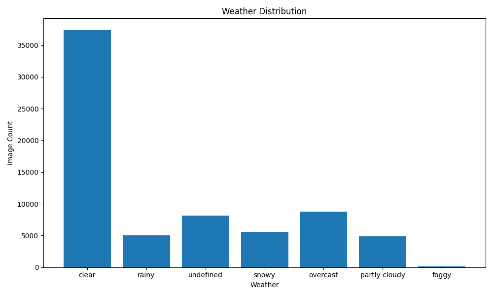

### Observation

Clear weather dominates the dataset significantly while adverse conditions such as foggy and snowy weather are comparatively underrepresented.

### ADAS Significance

Perception systems trained mostly on clear-weather data may show reduced robustness under degraded visibility conditions.

---

## Scene Distribution

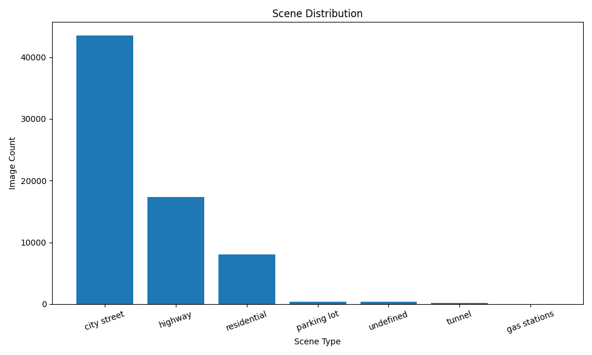

### Observation

City street scenes dominate the dataset followed by highway and residential scenarios.

### ADAS Significance

The dataset appears strongly urban-focused, which is useful for dense traffic perception analysis but may underrepresent uncommon operational domains.

---

## Time Of Day Distribution

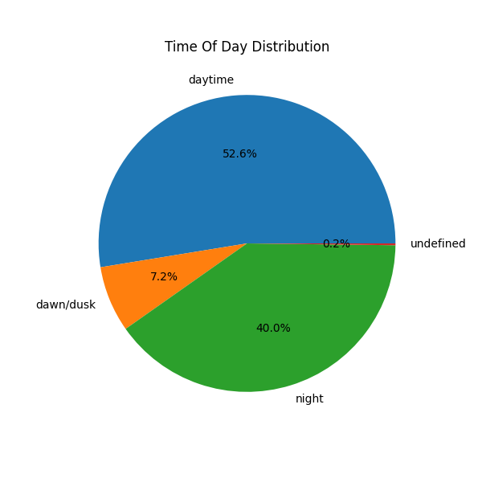

### Observation

Daytime scenes dominate the dataset while dawn/dusk scenarios are comparatively limited.

### ADAS Significance

Heavy daytime dominance may reduce perception robustness under low-illumination driving conditions.

---

# Object Analysis Results

## Object Class Distribution

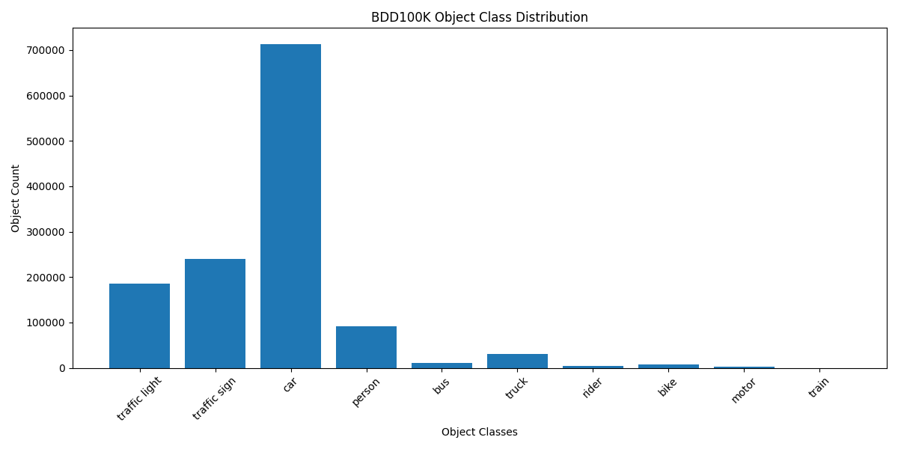

### Observation

Cars dominate the dataset significantly while vulnerable road users such as riders and motorcycles appear comparatively less frequent.

### ADAS Significance

Heavy class imbalance may bias object detectors toward dominant vehicle classes while reducing robustness for safety-critical vulnerable road users.

---

## Bounding Box Area Distribution

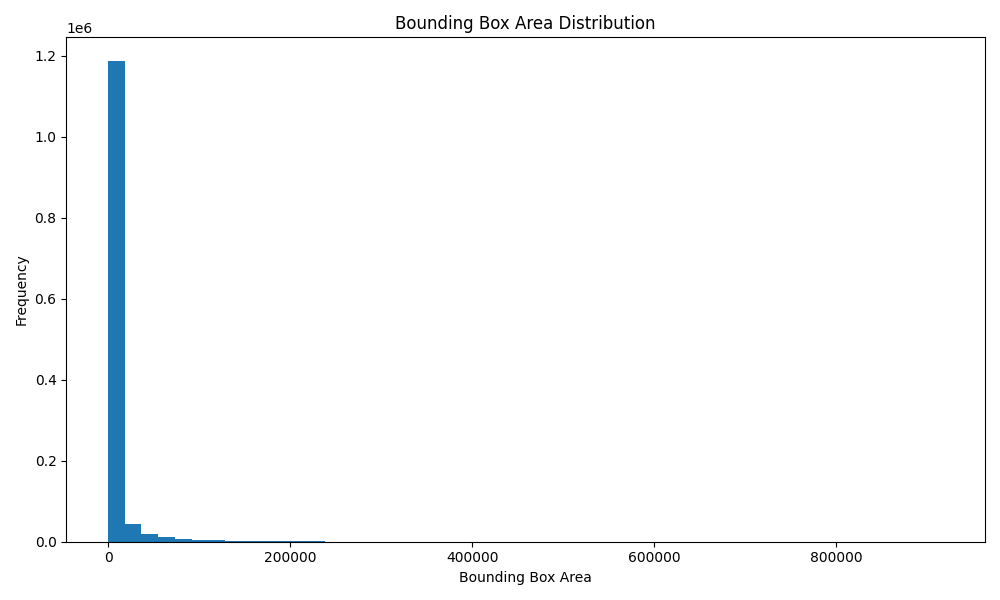

### Observation

The bounding box area distribution is heavily right-skewed, indicating a large concentration of very small objects.

### ADAS Significance

Small bounding boxes often correspond to distant traffic participants or infrastructure, making long-range perception significantly more difficult.

---

## Occlusion Distribution

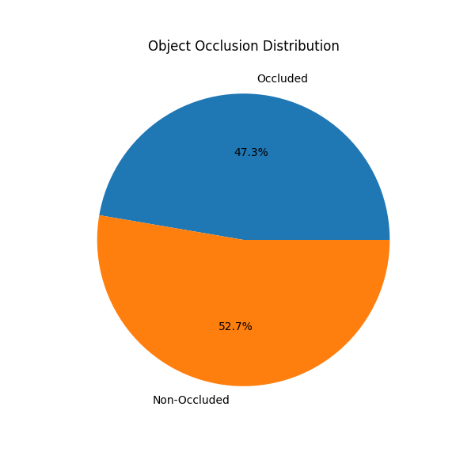

### Observation

Approximately 47% of objects appear partially occluded.

### ADAS Significance

High occlusion ratios indicate realistic urban driving complexity and increased perception difficulty for detection and tracking systems.

---

## Class Distribution Across Time Of Day

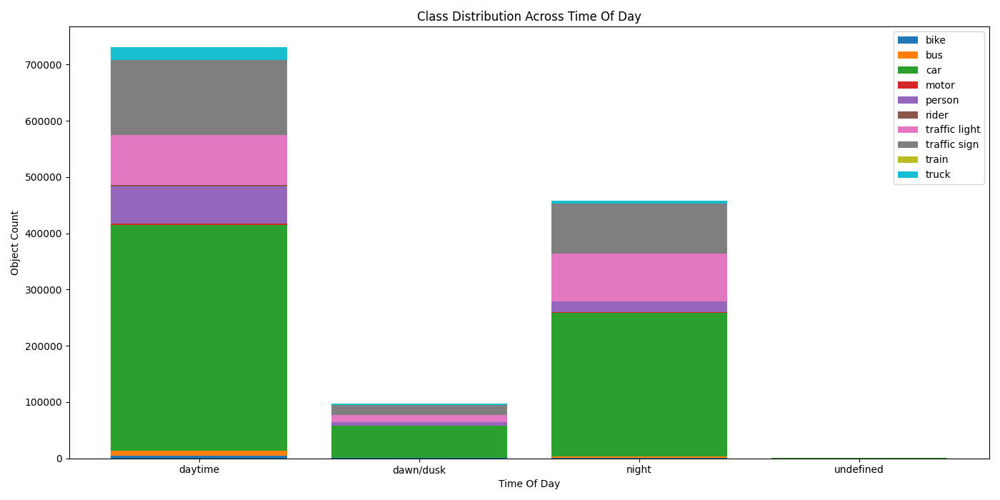

### Observation

Object visibility distribution changes noticeably across daytime, nighttime and dawn/dusk conditions.

### ADAS Significance

Illumination conditions significantly affect perception robustness and may impact detector reliability during nighttime driving.

---

## VRU Perception Risk Analysis

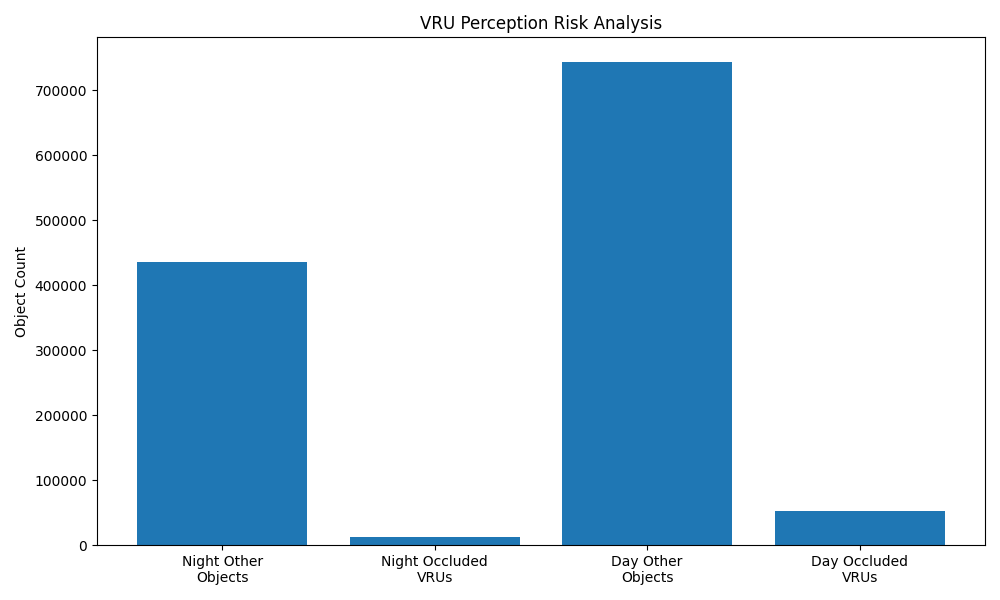

### Observation

Nighttime occluded vulnerable road users form a comparatively smaller but highly important subset of perception scenarios.

### ADAS Significance

Night + occlusion + vulnerable road users represent one of the most safety-critical and difficult perception conditions for autonomous driving systems.

---

# Key Findings

* Nearly half of the detected objects are partially occluded, indicating realistic urban driving complexity.
* The dataset is strongly dominated by daytime and clear-weather scenarios.
* Vulnerable road users are comparatively less represented than vehicle classes.
* Small object dominance suggests substantial long-range perception challenges.
* Nighttime occluded VRUs represent highly safety-critical perception scenarios.


# Training Pipeline and ADAS-Oriented Model Strategy

## Model Selection Thought Process

Although multiple object detection models already trained specifically on BDD100K are publicly available, the primary objective of this project was not only maximizing benchmark accuracy, but designing a practical and reproducible ADAS-oriented perception pipeline.

Because of this, YOLOv8 was selected as the primary baseline architecture.

The decision was influenced by multiple engineering and perception-related considerations:

* real-time inference suitability for ADAS applications
* simpler deployment and reproducibility
* strong ecosystem and tooling support
* easier Docker integration
* faster experimentation cycle
* modular fine-tuning workflow
* lower computational overhead compared to heavier two-stage detectors

Additionally, the earlier dataset analysis already revealed several important perception challenges:

* high object occlusion
* strong class imbalance
* long-tail small object distribution
* nighttime visibility challenges
* vulnerable road user underrepresentation

Therefore, the focus was intentionally shifted toward:

* perception-oriented evaluation
* environmental robustness analysis
* difficult scenario understanding
* VRU-focused analysis
* training strategy design

rather than only selecting the highest-performing benchmark architecture.

The selected approach therefore uses:

```text
COCO-pretrained YOLOv8
            ↓
BDD100K domain adaptation / fine-tuning
            ↓
ADAS-oriented evaluation and analysis
```

This allows leveraging strong generic visual feature learning from COCO while adapting the detector toward autonomous driving perception scenarios present in BDD100K.

A lighter YOLO variant was also preferred because it better aligns with practical autonomous driving constraints such as:

* inference latency
* deployment feasibility
* iterative experimentation
* future edge-device deployment considerations

The overall intention was to balance:

* perception robustness
* engineering practicality
* reproducibility
* deployment-oriented thinking
  rather than optimizing purely for leaderboard accuracy.


---

## Why Curriculum Learning Was Introduced

Traditional training pipelines randomly feed all samples to the detector without considering scene difficulty progression.

However, ADAS perception difficulty is not uniform.

For example:

* daytime highway scene with few objects is relatively easier
* nighttime urban scene with dense traffic and VRUs is significantly harder
* occluded pedestrians under poor illumination are safety-critical perception challenges

Because of this, the training pipeline was intentionally designed around a curriculum-inspired learning strategy.

The main idea is to gradually increase scene complexity during training.

---

## Curriculum Learning Strategy

The dataset is progressively organized into:

```text
Easy Scenes
      ↓
Moderate Scenes
      ↓
Hard Perception Scenarios
```

instead of training on fully randomized samples from the beginning.

This allows the detector to first learn:

* stable object representations
* basic scene understanding
* easier perception patterns

before being exposed to:

* dense traffic
* occlusion
* nighttime visibility
* vulnerable road users
* difficult environmental conditions

---

## Scene Difficulty Estimation

A dedicated difficulty analyzer was designed to estimate scene complexity.

Each image is scored using multiple perception-oriented factors identified during earlier dataset analysis.

## Difficulty Factors

| Factor               | Reason                         |
| -------------------- | ------------------------------ |
| nighttime scenes     | reduced visibility             |
| occluded objects     | partial perception difficulty  |
| VRU presence         | safety-critical detection      |
| dense traffic scenes | perception clutter             |
| small objects        | long-range detection challenge |

---

## Difficulty Scoring Pipeline

```text
Image Record
      ↓
Difficulty Analyzer
      ↓
Difficulty Score
      ↓
Easy / Medium / Hard Classification
      ↓
Curriculum Scheduler
      ↓
Training Pipeline
```

---

## Example Difficulty Logic

Images containing:

* nighttime conditions
* multiple occluded objects
* vulnerable road users
* dense object distributions
* smaller bounding boxes

receive higher difficulty scores.

This allows the curriculum scheduler to gradually introduce harder perception scenarios into training.

---

## ADAS-Oriented Perception Thinking

The overall pipeline was intentionally designed around autonomous driving perception challenges instead of generic object detection experimentation.

The focus was shifted toward:

* environmental robustness
* safety-critical object visibility
* vulnerable road user analysis
* difficult scene understanding
* operational domain perception

rather than only global mAP optimization.

This creates a perception pipeline closer to real-world ADAS development workflows.

---

## Training Pipeline Architecture

```text
BDD Dataset
      ↓
Parser + Loader
      ↓
Structured Image Records
      ↓
Difficulty Analyzer
      ↓
Curriculum Scheduler
      ↓
Curriculum Loader
      ↓
Training Strategy
      ↓
YOLO Dataset Converter
      ↓
YOLO Training
      ↓
Evaluation
```

---

## Why Strategy Pattern Was Used

Different object detection frameworks require:

* different training APIs
* different dataset formats
* different preprocessing pipelines
* different export logic

However, the overall training lifecycle remains largely similar.

Because of this, a strategy-based architecture was introduced.

This allows:

* model-specific logic to remain isolated
* common training pipeline reuse
* easier future extension toward RetinaNet, DETR, FasterRCNN etc.
* cleaner experimentation workflow

---

## Training Module Structure

```text
src/train/
├── curriculum/
│   ├── difficulty_analyzer.py
│   ├── curriculum_scheduler.py
│   └── curriculum_loader.py
│
├── strategies/
│   ├── base_strategy.py
│   └── yolo_strategy.py
│
├── pipeline/
│   └── trainer.py
│
└── utils/
    └── dataset_converter.py
```

---

# File Responsibilities

## `difficulty_analyzer.py`

Responsible for:

* scene difficulty estimation
* perception complexity analysis
* score generation for curriculum learning

This acts as the foundation of the curriculum learning pipeline.

---

## `curriculum_scheduler.py`

Responsible for:

* organizing records into difficulty stages
* grouping easy / medium / hard scenes
* preparing staged learning progression

---

## `curriculum_loader.py`

Responsible for:

* stage-wise dataset retrieval
* curriculum-aware data access
* training-stage sample delivery

---

## `base_strategy.py`

Defines the common interface for all future training strategies.

This ensures every detector implements:

* dataset preparation
* model construction
* training
* evaluation

---

## `yolo_strategy.py`

Contains:

* YOLO-specific logic
* dataset conversion calls
* model initialization
* YOLO training integration

YOLO-specific functionality remains isolated from the rest of the pipeline.

---

## `trainer.py`

Acts as the common orchestration layer.

Responsible for:

* curriculum integration
* strategy execution
* training flow management

The trainer remains completely model agnostic.

---

## `dataset_converter.py`

Responsible for converting internal dataset representation into YOLO-compatible training format.

This separation prevents the core dataset loader from becoming framework dependent.

---

# Sanity Test Files

The repository also contains lightweight sanity tests for validating each training module independently.

This was intentionally added to:

* simplify debugging
* improve modular verification
* validate architectural layers individually

---

# Training Sanity Test Commands

## Difficulty Analyzer

```bash
docker run --rm \
-v $(pwd)/data:/app/data \
-v $(pwd)/outputs:/app/outputs \
ml-bdd-pipeline \
python -m src.tests.test_difficulty_analyzer
```

---

## Curriculum Loader

```bash
docker run --rm \
-v $(pwd)/data:/app/data \
-v $(pwd)/outputs:/app/outputs \
ml-bdd-pipeline \
python -m src.tests.test_curriculum_loader
```

---

## Training Pipeline

```bash
docker run --rm \
-v $(pwd)/data:/app/data \
-v $(pwd)/outputs:/app/outputs \
ml-bdd-pipeline \
python -m src.tests.test_training_pipeline
```

---

## YOLO Dataset Conversion

```bash
docker run --rm \
-v $(pwd)/data:/app/data \
-v $(pwd)/outputs:/app/outputs \
ml-bdd-pipeline \
python -m src.tests.test_yolo_converter
```

---

# Training Outputs and Observations

The detector was trained using:

```text
500 medium-difficulty training images
200 epochs
YOLOv8 medium configuration
```

The primary objective of this phase was not maximizing benchmark accuracy, but validating:

* curriculum-aware training integration
* ADAS-oriented evaluation workflow
* scenario-based benchmarking
* perception-focused analysis pipeline

while observing how the detector behaves under different driving conditions.

---

# Training Progression

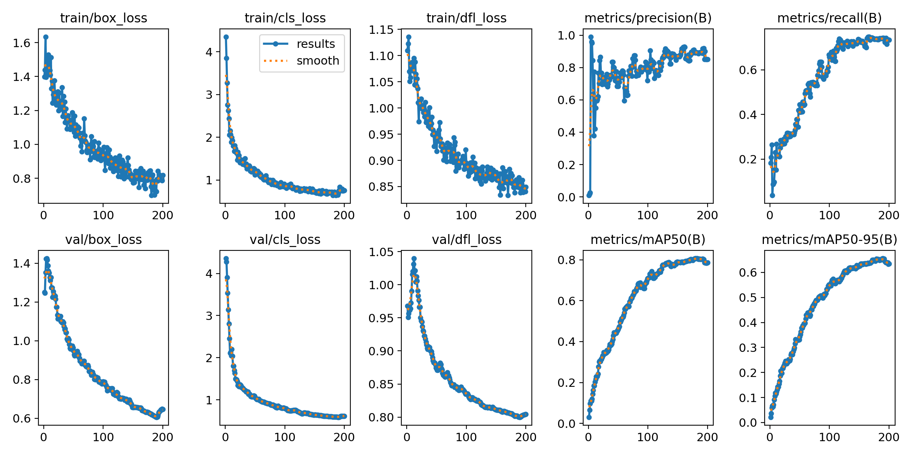

## Observation

The training and validation losses continuously reduce across epochs, showing stable convergence during training.

Some important observations:

* box loss gradually decreases, indicating improving localization quality
* classification loss stabilizes over time
* mAP50 steadily improves throughout training
* recall also improves progressively during later epochs

Since the training was performed only on a relatively small subset of medium-difficulty images, the model still has limitations on difficult scenarios, but the training trend shows that the pipeline is learning meaningful object representations.

---

# Precision-Recall Curve

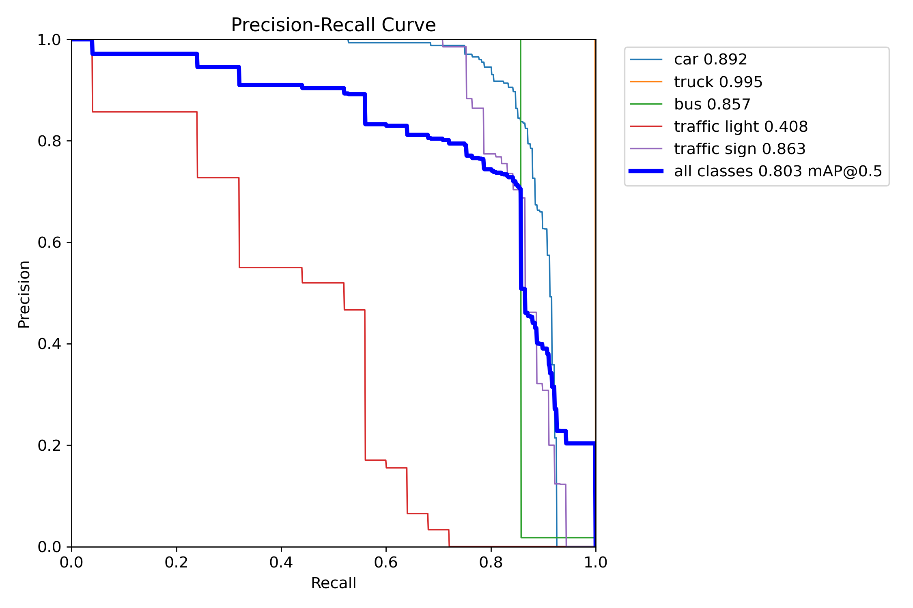

## Observation

The detector performs strongly on larger and more frequently occurring vehicle classes such as:

* car
* truck
* bus

while traffic-light detection remains comparatively weaker.

This behavior is expected because:

* traffic lights are smaller objects
* nighttime visibility affects them heavily
* they occupy fewer pixels in the image
* the current dataset subset is relatively limited

The overall mAP@0.5 reaching around:

```text
0.80
```

is reasonable for the current training scale and subset size.

---

# Precision vs Confidence

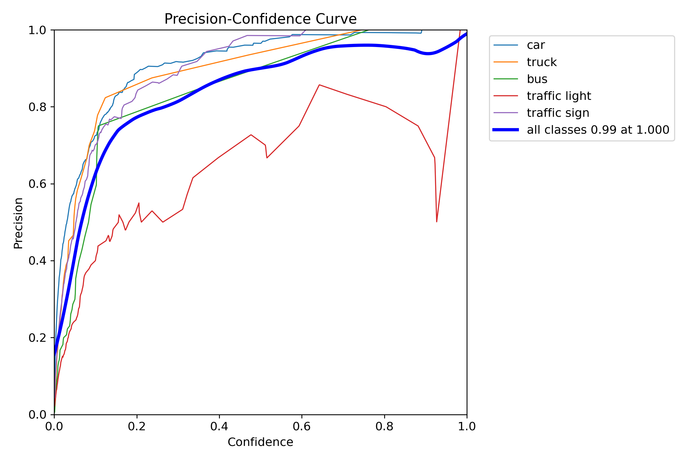

## Observation

Precision increases steadily as confidence threshold increases.

This indicates:

* higher-confidence predictions are generally reliable
* the detector becomes more selective at higher confidence levels
* false positives reduce significantly at stronger confidence thresholds

Vehicle-related classes remain consistently stable across confidence levels compared to smaller infrastructure objects.

---

# Recall vs Confidence

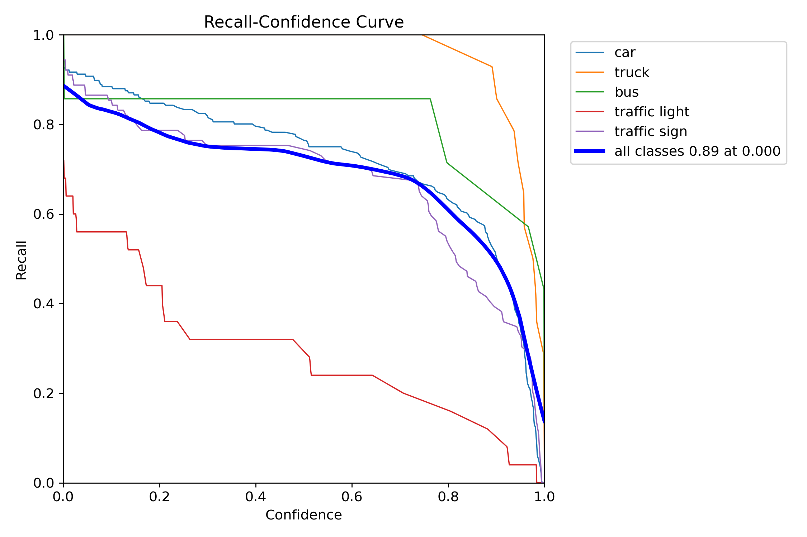

## Observation

Recall decreases as confidence threshold increases, which is expected behavior in object detection systems.

The detector is able to retain relatively strong recall for:

* cars
* trucks
* buses

while smaller classes such as traffic lights show larger drops.

This again highlights the challenge of detecting:

* small objects
* distant objects
* nighttime infrastructure elements

using limited training data.

---

# F1-Confidence Curve

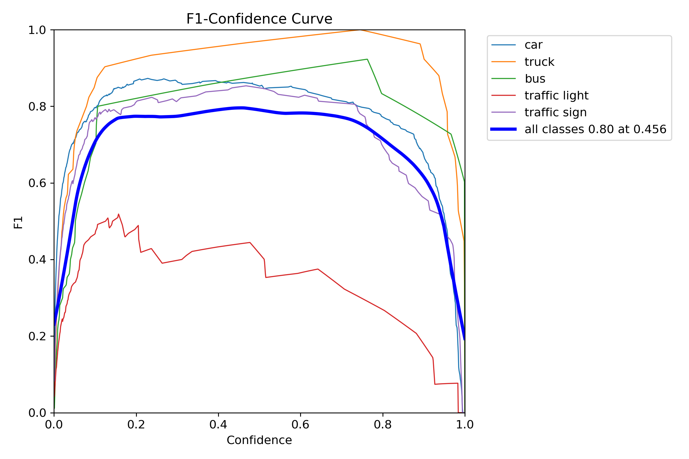

## Observation

The F1 curve helps identify the balance point between precision and recall.

The detector achieves its best overall balance near:

```text
confidence ≈ 0.45
```

which suggests that moderate confidence thresholds provide more balanced ADAS perception behavior compared to extremely aggressive filtering.

---

# Confusion Matrix Analysis

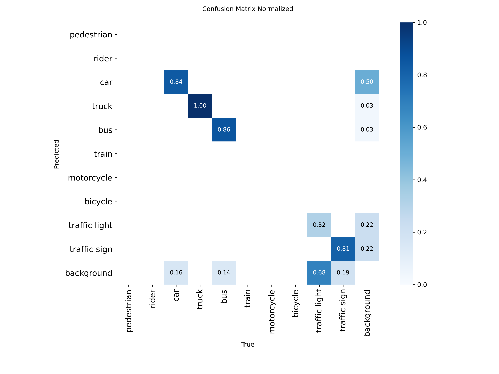

## Observation

The confusion matrix shows stronger classification consistency for:

* car
* truck
* bus
* traffic sign

while traffic lights remain comparatively harder.

Some objects are still being partially missed and mapped to background, especially:

* smaller infrastructure objects
* low-visibility detections
* distant scene elements

This behavior aligns with the earlier scenario-based evaluation observations.

---

# Training Batch Visualization during training 

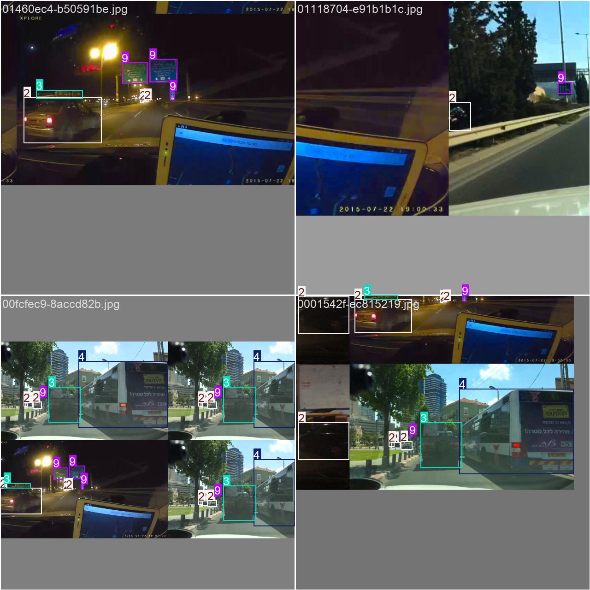

## Observation

The training batches already show strong diversity in:

* daytime scenes
* nighttime scenes
* dense traffic
* highway environments
* urban environments

This diversity is important because ADAS systems must generalize across highly changing operational conditions instead of learning only simplified driving scenes.

---

# Validation Prediction Visualization during training 

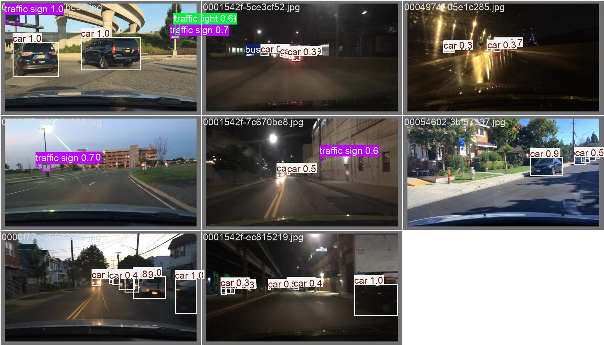

## Observation

Validation predictions show that the detector is able to identify:

* vehicles
* traffic signs
* traffic lights

across multiple environmental conditions.

Predictions remain stronger for larger nearby vehicles, while distant or low-visibility objects remain comparatively difficult.

This directly matches the curriculum and scenario benchmarking observations discussed earlier.

---

# Validation Ground Truth Visualization


## Observation

Ground-truth visualization helps understand the actual scene complexity present inside the validation data.

Several frames contain:

* multiple vehicles
* dense traffic
* nighttime illumination
* overlapping objects
* small traffic infrastructure elements

This further validates why scenario-based and curriculum-based evaluation are important for ADAS perception systems instead of relying only on aggregate benchmark metrics.


## * Quantitative Analysis 

## Evaluation Architecture and ADAS-Oriented Benchmarking Strategy

Traditional object detection evaluation generally focuses only on aggregate metrics such as:

* overall mAP
* precision
* recall

However, ADAS perception systems operate under highly diverse and safety-critical driving conditions where perception difficulty is not uniform across all scenes.

For example:

* a daytime highway scene with few visible objects is comparatively easier
* a nighttime urban scene with dense traffic and occluded pedestrians is significantly more difficult
* vulnerable road users under low visibility conditions represent highly safety-critical perception scenarios

Because of this, the evaluation pipeline was intentionally designed from an ADAS perception perspective rather than treating all validation samples equally.

The evaluation architecture was divided into two major perception-oriented benchmarking groups:

---

# 1. Curriculum-Based Evaluation

The first evaluation strategy focuses on scene difficulty progression.

Instead of evaluating the detector only globally, the validation data was grouped into:

```text
Easy Scenes
      ↓
Medium Difficulty Scenes
      ↓
Hard Perception Scenarios
```

using the same difficulty analysis pipeline introduced during curriculum learning.

This allows analyzing how detector performance changes as perception complexity increases.

---

# Why Difficulty-Based Evaluation Was Introduced

ADAS perception difficulty is highly dependent on environmental and object-level complexity.

Scenes become increasingly difficult when they contain:

* nighttime visibility conditions
* heavy object occlusion
* vulnerable road users
* dense traffic
* smaller distant objects

Because of this, a dedicated difficulty analyzer was designed earlier during the curriculum learning stage.

The same perception-oriented difficulty logic was intentionally reused during evaluation to maintain consistency between:

* training strategy
* scene understanding
* evaluation methodology

This creates a much more realistic understanding of detector robustness compared to generic aggregate evaluation.

---

# Easy Scene Evaluation

Easy scenes generally contain:

* better illumination
* lower traffic density
* fewer occlusions
* larger visible objects
* simpler perception conditions

These scenes help evaluate:

* baseline detector stability
* initial object representation quality
* general scene understanding capability

Easy-scene evaluation helps establish the detector’s lower-bound operational performance under relatively favorable conditions.

---

# Medium Difficulty Evaluation

Medium scenes represent moderately complex driving conditions.

These may include:

* moderate traffic density
* partial occlusion
* mixed object scales
* moderately challenging environmental conditions

This stage helps analyze how the detector behaves once scene complexity begins increasing beyond ideal conditions.

Medium-difficulty evaluation acts as an intermediate robustness benchmark between stable and highly challenging perception environments.

---

# Hard Scene Evaluation

Hard scenes intentionally contain highly challenging perception conditions such as:

* nighttime driving
* dense urban traffic
* vulnerable road users
* heavy occlusion
* smaller distant objects
* cluttered scene structure

These scenarios are significantly more important from an ADAS safety perspective because perception failures under these conditions may directly impact downstream planning and decision-making systems.

Hard-scene evaluation therefore helps analyze:

* perception degradation
* localization instability
* missed detections
* safety-critical perception failures

rather than only measuring average benchmark accuracy.

---

# Difficulty Evaluation Pipeline

```text
Validation Dataset
        ↓
Difficulty Analyzer
        ↓
Difficulty Score Generation
        ↓
Easy / Medium / Hard Classification
        ↓
Curriculum Benchmark Evaluation
        ↓
Quantitative + Qualitative Analysis
```

---

# 2. Scenario-Based Evaluation

The second evaluation strategy focuses on operational driving scenarios.

Instead of grouping scenes only by numerical difficulty score, evaluation was also organized around specific perception conditions commonly observed in autonomous driving systems.

This helps analyze detector robustness under targeted environmental and safety-critical operational conditions.

---

# Why Scenario-Based Evaluation Was Introduced

ADAS systems are expected to remain robust across multiple operational domains and environmental conditions.

However, aggregate metrics alone often fail to explain:

* where the detector struggles
* which perception conditions are difficult
* which object categories degrade under specific environments
* how illumination and occlusion affect safety-critical objects

Because of this, the validation data was further grouped into scenario-oriented benchmark subsets.

This allows targeted analysis of perception behavior under realistic driving conditions.

---

# Implemented Scenario Benchmarks

The following benchmark categories were introduced:

| Scenario Category    | Purpose                                                         |
| -------------------- | --------------------------------------------------------------- |
| Day + VRU            | Evaluate vulnerable road user detection under good illumination |
| Night + VRU          | Analyze nighttime VRU visibility robustness                     |
| Day + Non-VRU        | Baseline daytime object perception                              |
| Night + Non-VRU      | Evaluate illumination impact independent of VRUs                |
| Day + Occluded       | Analyze daytime occlusion handling                              |
| Night + Occluded     | Evaluate combined illumination + occlusion difficulty           |
| Day + Non-Occluded   | Stable baseline perception comparison                           |
| Night + Non-Occluded | Isolate nighttime illumination impact                           |
| Day + Occluded VRU   | Safety-critical daytime VRU visibility                          |
| Night + Occluded VRU | Highly challenging ADAS perception scenario                     |
| Dense Traffic Scenes | Analyze cluttered scene perception behavior                     |

---

# ADAS Significance of Scenario-Based Evaluation

This evaluation structure allows the perception system to be analyzed beyond generic accuracy metrics.

For example:

* reduced recall in nighttime VRU scenarios may indicate illumination-sensitive perception behavior
* failures in occluded VRU scenes may indicate partial visibility limitations
* localization instability in dense traffic scenes may reveal perception clutter challenges
* degraded performance on small distant objects may indicate long-range perception limitations

This creates a much more realistic perception evaluation pipeline aligned with real-world autonomous driving challenges.

---

# Overall Evaluation Architecture

```text
Validation Dataset
        ↓
Benchmark Selection
        ↓
├── Curriculum-Based Evaluation
│       ├── Easy
│       ├── Medium
│       └── Hard
│
└── Scenario-Based Evaluation
        ├── VRU-Based
        ├── Occlusion-Based
        ├── Illumination-Based
        └── Dense Scene Analysis
                ↓
GT vs Prediction Visualization
                ↓
Quantitative Metrics
                ↓
ADAS-Oriented Perception Insights
```

# Evaluation Module Structure

The evaluation pipeline was intentionally designed as a modular and reusable perception evaluation framework instead of a single monolithic validation script.

The primary objective was to separate:

* benchmark generation
* quantitative evaluation
* qualitative visualization
* perception-oriented analysis

so that new evaluation strategies and perception experiments can later be added independently without modifying the core pipeline.

---

# Evaluation Architecture

```text
src/evaluation/
├── benchmark/
│   ├── curriculum_benchmark.py
│   └── scene_benchmark.py
│
├── metrics/
│   └── quantitative_evaluator.py
│
└── visualizer/
    ├── gt_vs_prediction_visualizer.py
    └── prediction_visualizer.py
```

---

# Benchmark Layer

The benchmark layer is responsible for generating evaluation subsets from the validation dataset.

Instead of evaluating the detector globally on the complete dataset, the validation data is grouped into perception-oriented benchmark categories.

This allows targeted analysis of:

* perception difficulty
* environmental robustness
* VRU visibility
* illumination impact
* occlusion handling
* dense traffic perception behavior

---

# `curriculum_benchmark.py`

Responsible for curriculum-aware evaluation grouping.

This module reuses the same difficulty analysis logic introduced during curriculum learning.

The benchmark groups validation data into:

```text
Easy
Medium
Hard
```

based on:

* nighttime visibility
* occlusion
* vulnerable road users
* scene density
* small object presence

This allows analyzing how detector robustness changes as perception complexity increases.

The objective was to validate whether the curriculum-based training philosophy aligns with actual detector behavior during evaluation.

---

# `scene_benchmark.py`

Responsible for scenario-aware benchmark generation.

Instead of grouping scenes only by numerical difficulty, this module creates operational driving condition subsets commonly observed in autonomous driving systems.

Implemented benchmark categories include:

* day + VRU
* night + VRU
* day + non-VRU
* night + non-VRU
* day + occluded
* night + occluded
* day + non-occluded
* night + non-occluded
* day + occluded VRU
* night + occluded VRU
* dense traffic scenes

This helps isolate specific perception challenges and enables targeted robustness analysis.

---

# Metrics Layer

The metrics layer is responsible for quantitative evaluation.

This stage focuses on computing:

* precision
* recall
* mAP50
* mAP50-95

for both:

* curriculum-based subsets
* scenario-based subsets

instead of relying only on global dataset-level metrics.

---

# `quantitative_evaluator.py`

Responsible for running quantitative evaluation on benchmark subsets.

Main responsibilities:

* converting selected benchmark records into temporary YOLO-compatible evaluation datasets
* invoking Ultralytics validation pipeline
* extracting quantitative metrics
* saving evaluation metrics for later visualization

The evaluator intentionally reuses the benchmark layer so that the same evaluation logic can be applied consistently across all scenario groups.

---

# Visualization Layer

The visualization layer is responsible for qualitative perception analysis.

Instead of analyzing only numerical metrics, the evaluation pipeline also supports visual comparison between:

* ground truth annotations
* detector predictions

This helps identify:

* missed detections
* localization instability
* false positives
* VRU perception failures
* illumination-related degradation
* dense-scene perception limitations

---

# `prediction_visualizer.py`

Responsible for generating detector prediction visualizations.

This module overlays predicted bounding boxes directly on validation images.

The primary purpose is to quickly inspect detector behavior visually during experimentation and debugging.

---

# `gt_vs_prediction_visualizer.py`

Responsible for comparative qualitative evaluation between:

* ground truth annotations
* predicted detections

Visualization convention:

* green boxes → ground truth
* red boxes → model predictions

This module was intentionally introduced because prediction-only visualization often hides:

* missed detections
* partial localization failures
* safety-critical perception errors

The visualizer also supports scenario-aware output organization such as:

```text
outputs/gt_vs_prediction/
├── easy/
├── hard/
├── night_vru/
├── night_occluded_vru/
└── dense_scenes/
```

This enables structured qualitative analysis across multiple perception conditions.

---

# Evaluation Sanity Tests

Lightweight modular sanity tests were added for validating each evaluation layer independently.

This helps simplify:

* debugging
* architecture verification
* benchmark validation
* visualization testing

without requiring full end-to-end retraining.

---

# Evaluation Test Responsibilities

## `test_scene_benchmark.py`

Validates scenario-aware benchmark grouping.

Checks:

* scenario filtering
* subset generation
* benchmark summary counts

---

## `test_curriculum_based_gt_vs_prediction_visualizer.py`

Generates curriculum-aware GT vs prediction visualizations for:

* easy scenes
* medium scenes
* hard scenes

This helps visually analyze perception degradation as scene complexity increases.

---

## `test_scene_based_gt_vs_prediction_visualizer.py`

Generates scenario-aware GT vs prediction visualizations.

Supports evaluation for scenarios such as:

* night + VRU
* day + occluded
* night + occluded VRU
* dense scenes

This helps isolate operational-condition-specific perception behavior.

---

## `test_quantitative_curriculum_evaluator.py`

Runs quantitative evaluation for:

* easy
* medium
* hard

benchmark groups.

The generated metrics are later used for curriculum-based metric comparison plots.

---

## `test_metrics_visualizer.py`

Responsible for plotting quantitative evaluation comparisons.

Currently supports:

* curriculum difficulty vs mAP50
* curriculum difficulty vs recall

Generated plots are stored under:

```text
outputs/evaluation/plots/
```

These plots help visually analyze detector robustness degradation as scene complexity increases.

---

# Evaluation Sanity Test Commands

## Scenario Benchmark Validation

```bash
docker run --rm \
-v $(pwd)/data:/app/data \
-v $(pwd)/outputs:/app/outputs \
ml-bdd-pipeline \
python -m src.tests.test_scene_benchmark
```

---

## Curriculum GT vs Prediction Visualization

```bash
docker run --rm \
-v $(pwd)/data:/app/data \
-v $(pwd)/outputs:/app/outputs \
ml-bdd-pipeline \
python -m src.tests.test_curriculum_based_gt_vs_prediction_visualizer
```

---

## Scenario-Based GT vs Prediction Visualization

```bash
docker run --rm \
-v $(pwd)/data:/app/data \
-v $(pwd)/outputs:/app/outputs \
ml-bdd-pipeline \
python -m src.tests.test_scene_based_gt_vs_prediction_visualizer
```

---

## Quantitative Curriculum Evaluation

```bash
docker run --rm \
-v $(pwd)/data:/app/data \
-v $(pwd)/outputs:/app/outputs \
ml-bdd-pipeline \
python -m src.tests.test_quantitative_curriculum_evaluator
```

---

## Metrics Visualization

```bash
docker run --rm \
-v $(pwd)/outputs:/app/outputs \
ml-bdd-pipeline \
python -m src.tests.test_metrics_visualizer
```


## Scenario-Based Benchmarking and GT vs Prediction Evaluation

Traditional object detection evaluation generally focuses only on aggregate validation metrics.

However, ADAS perception systems must remain robust under multiple operational driving conditions where perception complexity changes significantly depending on:

* illumination
* occlusion
* traffic density
* vulnerable road user visibility
* environmental structure

Because of this, the evaluation pipeline was intentionally extended toward scenario-aware benchmarking.

Instead of evaluating only global detector performance, the validation dataset was grouped into targeted operational perception scenarios.

This allows analyzing how the detector behaves under realistic autonomous driving conditions rather than relying only on average benchmark metrics.

---

# GT vs Prediction Visualization Strategy

A dedicated qualitative evaluation pipeline was introduced for comparing:

* ground truth annotations
* model predictions

Visualization convention:

* green bounding boxes → ground truth
* red bounding boxes → detector predictions

The primary objective of this visualization pipeline is to expose:

* missed detections
* localization mismatch
* low-confidence predictions
* illumination-related degradation
* difficult perception conditions

instead of observing predictions alone.

---

# Implemented Scenario Benchmark Categories

The evaluation pipeline currently supports scenario-based benchmarking for:

* day + VRU
* night + VRU
* day + non-VRU
* night + non-VRU
* day + occluded
* night + occluded
* day + non-occluded
* night + non-occluded
* day + occluded VRU
* night + occluded VRU
* dense traffic scenes

The same evaluation framework can be reused for all scenario categories simply by selecting different benchmark subsets from the scenario benchmark layer.

---

# Example Scenario:
# Night + VRU + Occlusion Benchmark

The following examples demonstrate detector behavior under nighttime urban driving conditions containing:

* low illumination
* vulnerable road users
* partial visibility
* cluttered scene structure

These represent difficult perception scenarios for ADAS systems.

---

# Scenario Example 1

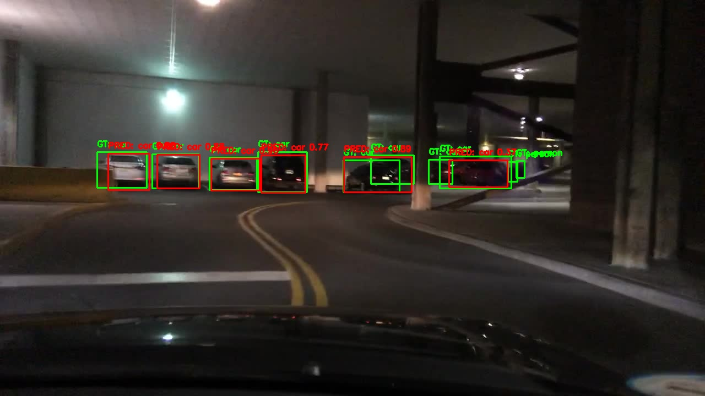

### Observation

The detector is able to identify most nearby vehicles reasonably well even under low-light conditions.

Larger objects closer to the ego vehicle are detected more consistently, while smaller and distant vehicles become comparatively harder to localize accurately.

### Possible Cause

This scene contains multiple difficult perception conditions simultaneously:

* nighttime illumination
* darker object regions
* distant objects
* partially visible vehicles

These conditions reduce visible object detail and make feature extraction more difficult.

### General Insight

This example shows how nighttime scenes increase perception difficulty, especially for smaller and farther traffic participants.

---

# Scenario Example 2

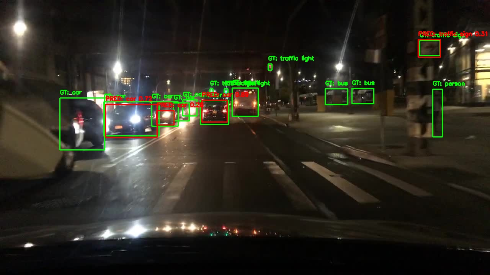

### Observation

The detector is able to detect several important traffic participants including:

* cars
* buses
* traffic lights
* pedestrians

However, confidence variation and slight localization mismatch can still be observed in darker and cluttered regions.

A false-positive traffic sign prediction is also visible in the scene.

### Possible Cause

The scene contains:

* strong headlight glare
* nighttime illumination
* object scale variation
* crowded urban structure

These conditions create inconsistent visual patterns and increase perception complexity.

### General Insight

Nighttime urban scenes with mixed object categories remain significantly more challenging compared to regular daytime driving conditions.

---

# Easy Benchmark Example

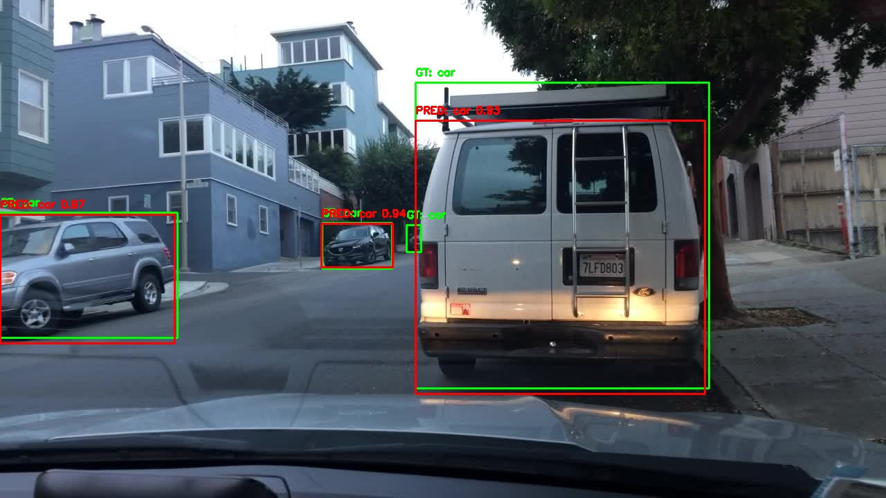

### Observation

The detector is able to localize most vehicles accurately with strong overlap between ground truth and predicted bounding boxes.

Prediction confidence also remains comparatively stable across nearby visible vehicles.

### Possible Cause

This scene contains relatively simpler perception conditions such as:

* daytime illumination
* lower traffic density
* larger visible objects
* minimal occlusion

These conditions provide clearer visual features and more stable object visibility.

### General Insight

This example shows that the detector performs more consistently under comparatively easier driving conditions where object visibility and scene structure remain stable.


# Medium Benchmark Example

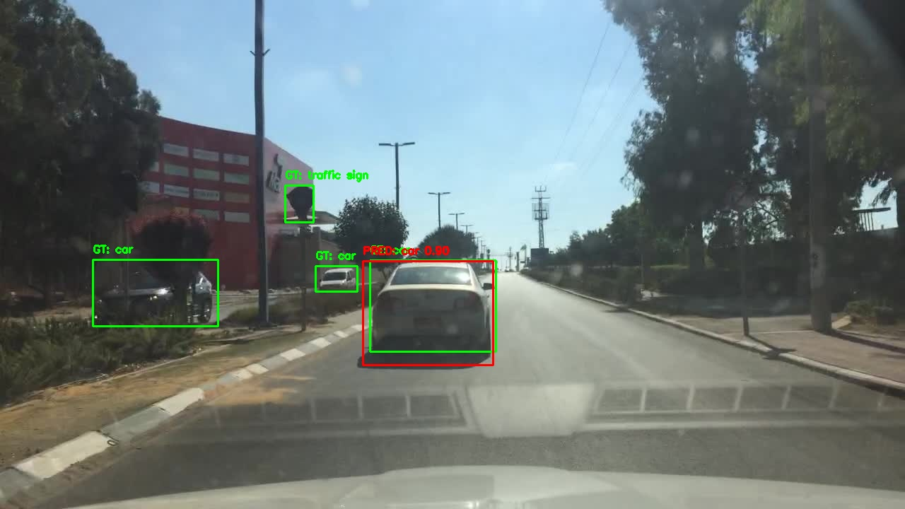

### Observation

The detector is able to identify the major nearby vehicles correctly while maintaining reasonably stable localization overlap with ground truth annotations.

However, smaller and more distant objects begin showing comparatively weaker localization consistency compared to easier scenes.

### Possible Cause

This scene contains moderately challenging perception conditions such as:

* mixed object scales
* brighter illumination regions
* partially distant objects
* moderate scene complexity

These conditions increase perception variability compared to simpler benchmark scenes.

### General Insight

This example demonstrates how detector behavior gradually becomes less stable as scene complexity increases beyond ideal perception conditions.

# Hard Benchmark Example

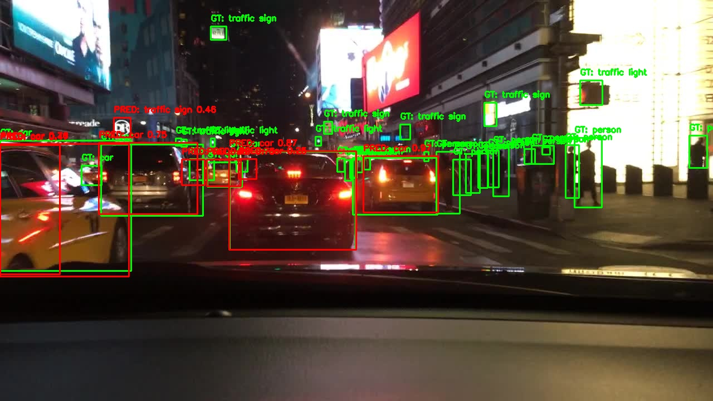

### Observation

The detector is still able to identify several major traffic participants, including vehicles, pedestrians, traffic lights, and traffic signs.

However, localization mismatch, overlapping predictions, and confidence variation become noticeably higher compared to easy and medium benchmark scenes.

Smaller and distant objects also become comparatively more difficult to localize consistently.

### Possible Cause

This scene combines several difficult perception conditions simultaneously such as:

* nighttime illumination
* dense urban traffic
* multiple nearby objects
* smaller distant traffic participants
* cluttered scene structure

These conditions increase scene complexity and reduce stable visual feature separation between nearby objects.


## Quantitative Curriculum-Based Evaluation

In addition to qualitative GT vs prediction visualization, quantitative evaluation was also performed across:

```text
Easy
Medium
Hard
```

curriculum benchmark groups.

The objective was to analyze how detector performance changes as perception complexity increases.

The following metrics were evaluated:

* mAP50
* Recall

These metrics help analyze both:

* localization quality
* object retrieval capability

under progressively difficult driving conditions.

---

# Curriculum Difficulty vs mAP50

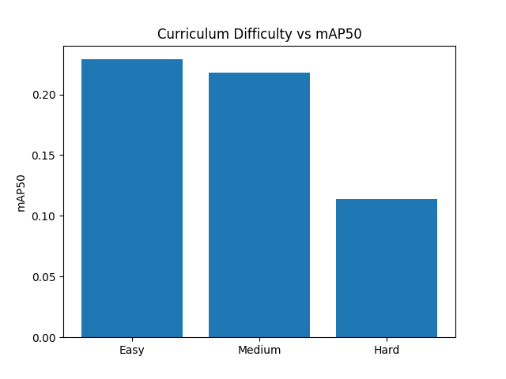

### Observation

The detector performs relatively consistently across easy and medium benchmark groups.

However, performance drops noticeably for hard benchmark scenes.

### General Insight

This trend indicates that the detector is able to maintain comparatively stable localization performance under simpler and moderately complex driving conditions.

However, harder scenes containing nighttime illumination, denser traffic, smaller objects, and cluttered environments introduce significantly higher perception complexity.

This directly affects localization quality and overall detection stability.

---

# Curriculum Difficulty vs Recall

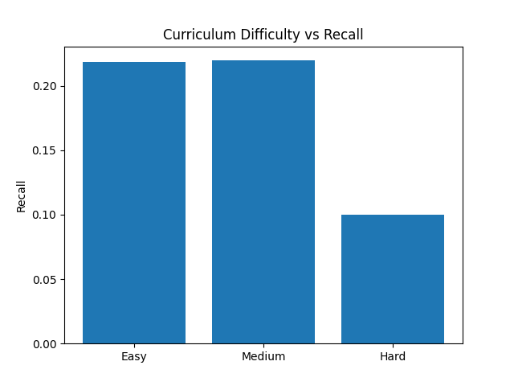

### Observation

Recall remains comparatively stable between easy and medium benchmark groups but drops significantly for hard scenes.

### General Insight

This indicates that the detector begins missing more objects as scene complexity increases.

Hard benchmark conditions such as:

* nighttime driving
* dense urban traffic
* smaller distant objects
* cluttered scene structure

make consistent object retrieval more difficult compared to easier perception conditions.

The trend also aligns with the qualitative observations seen earlier during GT vs prediction visualization.

---

# Overall Quantitative Insight

The quantitative results show a clear relationship between:

```text
scene difficulty
        ↓
perception robustness
```

As scene complexity increases, both localization quality and object retrieval capability begin degrading.

Even though the detector was trained only on a relatively small subset of approximately:

```text
500 images
```

the curriculum-based evaluation pipeline is still able to expose meaningful perception behavior differences across varying scene complexity levels.

### General Insight

This example demonstrates how detector robustness gradually degrades as perception complexity increases, especially under dense nighttime urban driving conditions.

# Important Experimental Note

The current detector was intentionally trained only on a relatively small subset of approximately:

```text
500 training images
````

for roughly:

```text
200 epochs
```

primarily using medium-difficulty curriculum samples.

The objective at this stage was mainly to validate:

* modular pipeline architecture
* curriculum-aware training integration
* scenario-based evaluation workflow
* reusable ADAS-oriented benchmarking pipeline

rather than maximizing final benchmark accuracy.

```# Development Workflow

```bash
git add .
git commit -m "message"
git push
```

---

# Author

Vinayak Mahabaleshwar Boormane